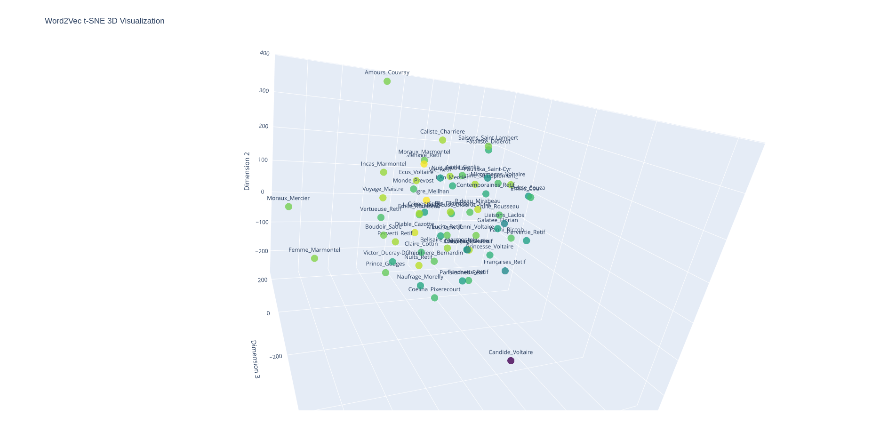

# lit2vec

This repository aims to analyze the relationships between literary works mentioned in scholarly works. Different from [co-occurence approach](https://github.com/MiMoText/lit_cooccurence), we here use word2vec method to messeaur the context similarity between mentions of literary works in scholarly works. Using [gensim](https://pypi.org/project/gensim/), the word2vec model was trained on our scholarly work corpus, which currently 26 texts or 289,746t tokens. More scholarly works will be added in the future (s. [Zotero Library](https://www.zotero.org/groups/2342956/mimotext/tags/MMT_scholarly-work/library)). 

## Table of Contents

- `work_identifier.txt`: contains all identifiers of literary works.
- `word2vec.model`: word2vec model trained on MiMoText scholarly work corpus usding [gensim](https://pypi.org/project/gensim/).
- `similarity.py`: compute similary between all work pairs, using [model.wv.similarity()](https://tedboy.github.io/nlps/generated/generated/gensim.models.Word2Vec.similarity.html).
- `similarity.tsv`: output of `similarity.py`
- `plt_2d.py`: plot all work_identifiers in a 2d space
- `plot_2d.html`: output of `plt_2d.py` (download and open it with broswer to explore it)
- `plt_3d.py`: plot all work_identifiers in a 3d space
- `plot_3d.html`: output of `plt_3d.py` (download and open it with broswer to explore it)

Screenshot of plots

